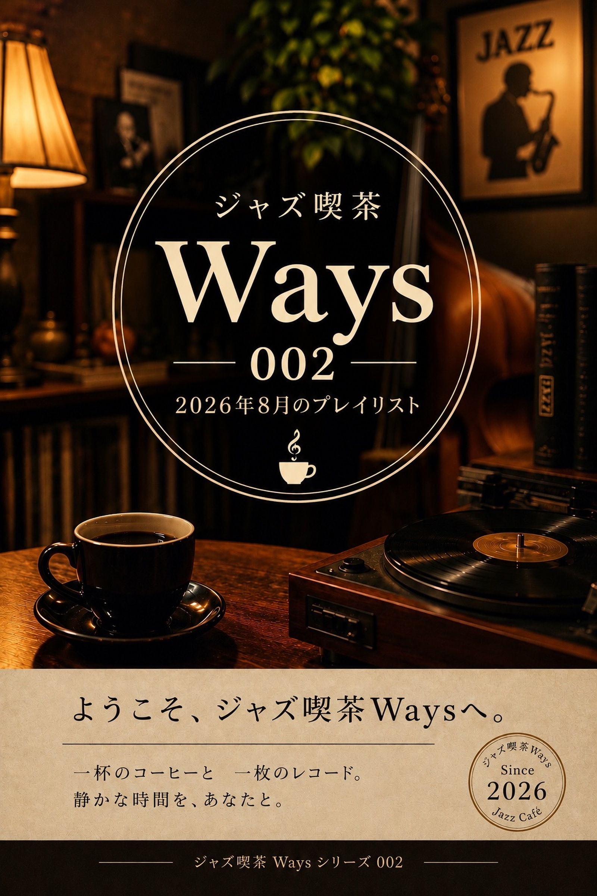
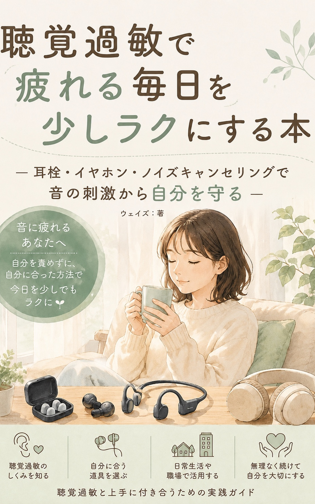

# ジャズ喫茶Ways

ジャズ喫茶Waysは、ジャズと過ごす心地よい時間を届けるデジタルジャズ喫茶です。

Kindleで本を販売するのは、その店を50年続けていくため。

---

## Waysの本棚

## ジャズ喫茶Waysシリーズ
### ジャズ喫茶Ways 001
[](https://www.amazon.co.jp/%E3%82%B8%E3%83%A3%E3%82%BA%E5%96%AB%E8%8C%B6Ways-001-Way-Out-West-ebook/dp/B0H9KCLVZL/ref=sr_1_1?__mk_ja_JP=%E3%82%AB%E3%82%BF%E3%82%AB%E3%83%8A&crid=MPMJ5CIRQ5W&dib=eyJ2IjoiMSJ9.PxScn5NXF6Ckgb7-Q8OCPhwroi9Osx-f-GjrCT8WpfSzp7XhfM-FQDt2BvEPlqnLqnDu6fqejcWLjZX3vLKobmoxdl_VDT5_IpoxTBbfZDgROEBEh1p2-uIOFkelzheqpY99B3CggI6DTeKIdZHBPwO_a057QNe0As_ZorqVf6U.A5AZQuJIfF1KcTm4OAp_ut84NlHm9Hl5Yp_Y1L3VHlg&dib_tag=se&keywords=%E3%82%B8%E3%83%A3%E3%82%BA%E5%96%AB%E8%8C%B6Ways&qid=1787469711&sprefix=%E3%82%B8%E3%83%A3%E3%82%BA%E5%96%AB%E8%8C%B6ways%2Caps%2C644&sr=8-1)

### ジャズ喫茶Ways 002

## 店主の日誌シリーズ
Waysの店主が、ジャズや音楽、日々の暮らしについて綴った本。

### 聴覚過敏 001
[](https://www.amazon.co.jp/%E8%81%B4%E8%A6%9A%E9%81%8E%E6%95%8F%E3%81%A7%E7%96%B2%E3%82%8C%E3%82%8B%E6%AF%8E%E6%97%A5%E3%82%92%E5%B0%91%E3%81%97%E3%83%A9%E3%82%AF%E3%81%AB%E3%81%99%E3%82%8B%E6%9C%AC-%E8%80%B3%E6%A0%93%E3%83%BB%E3%82%A4%E3%83%A4%E3%83%9B%E3%83%B3%E3%83%BB%E3%83%8E%E3%82%A4%E3%82%BA%E3%82%AD%E3%83%A3%E3%83%B3%E3%82%BB%E3%83%AA%E3%83%B3%E3%82%B0%E3%81%A7%E9%9F%B3%E3%81%AE%E5%88%BA%E6%BF%80%E3%81%8B%E3%82%89%E8%87%AA%E5%88%86%E3%82%92%E5%AE%88%E3%82%8B-%E3%82%A6%E3%82%A7%E3%82%A4%E3%82%BA-ebook/dp/B0H8T63C3V/ref=sr_1_10?__mk_ja_JP=%E3%82%AB%E3%82%BF%E3%82%AB%E3%83%8A&crid=Q2B40RVU3U5T&dib=eyJ2IjoiMSJ9.3otF5Y3Y8rGrd9VrEgg-T7CHm1jnFLk2pLDeqd8O0swwIFkMXH7lljIeicHaqeUWjknZD7nDjj5CgWhq3gA8yd_Fuxvix5Q5cD6tcXj03ybTkS_MI9T4deiGDcbIQeG1GWB64DpsJ0Cn_lGKTsYs5J4kQV1AQF0_875FOMLZkaYx1l7VTpyyS_5kOpPg1IOuJ0eaj7Uf4IPrVsCADiMA8g.fxbRuC_BGXgrWMJdnuoVCYQtBRsgLsWIwFiJxEs5I5E&dib_tag=se&keywords=%E8%81%B4%E8%A6%9A%E9%81%8E%E6%95%8F+%E6%9C%AC&qid=1787482642&sprefix=%E8%81%B4%E8%A6%9A%E9%81%8E%E6%95%8F+%E6%9C%AC%2Caps%2C514&sr=8-10)

### タスク管理 001
[](https://www.amazon.co.jp/%E5%A4%9A%E6%A9%9F%E8%83%BD%E3%82%A2%E3%83%97%E3%83%AA%E3%81%AB%E6%8C%AB%E6%8A%98%E3%81%97%E3%81%9F%E7%99%BA%E9%81%94%E9%9A%9C%E5%AE%B3%E5%BD%93%E4%BA%8B%E8%80%85%E3%81%8C%E8%A6%8B%E3%81%A4%E3%81%91%E3%81%9F%E3%80%81%E3%82%B7%E3%83%B3%E3%83%97%E3%83%AB%E3%81%AA%E3%82%BF%E3%82%B9%E3%82%AF%E7%AE%A1%E7%90%86-ASD%E3%83%BBADHD%E3%81%AE%E5%AE%9F%E8%A1%8C%E6%A9%9F%E8%83%BD%E3%81%AE%E5%BC%B1%E3%81%95%E3%81%A8Google-Todo%E3%81%A7%E4%BB%98%E3%81%8D%E5%90%88%E3%81%86%E6%96%B9%E6%B3%95-ASD%E3%83%BBADHD-%E3%83%9F%E3%83%8B%E3%83%9E%E3%83%AA%E3%82%B9%E3%83%88%E3%82%B7%E3%83%AA%E3%83%BC%E3%82%BA-ebook/dp/B0H93GJMBM/ref=sr_1_8?__mk_ja_JP=%E3%82%AB%E3%82%BF%E3%82%AB%E3%83%8A&crid=13J4BLT7YQ3UB&dib=eyJ2IjoiMSJ9.bus1gSI0gHXVPtK81X7yQIQF-Fu81E_ROrW2k-bMbkFAXjGbHXFgrnb_idFArWwJxwkup7XFqF8j6JDdx8qGjUUF7eKvRakUH6OPZJoF1uT8hVkXTlFRYAA9R_Cmz2WvpagXaUZ2dDH78E0oaxD9JQ.VfISw5gVIeeDI6u_myVjUMqKKr9ZOTmODbqcGK62O3Y&dib_tag=se&keywords=%E7%99%BA%E9%81%94%E9%9A%9C%E5%AE%B3+%E3%82%BF%E3%82%B9%E3%82%AF%E7%AE%A1%E7%90%86&qid=1787482945&sprefix=%E7%99%BA%E9%81%94%E9%9A%9C%E5%AE%B3+%E3%82%BF%E3%82%B9%E3%82%AF%E7%AE%A1%E7%90%86%2Caps%2C201&sr=8-8)

